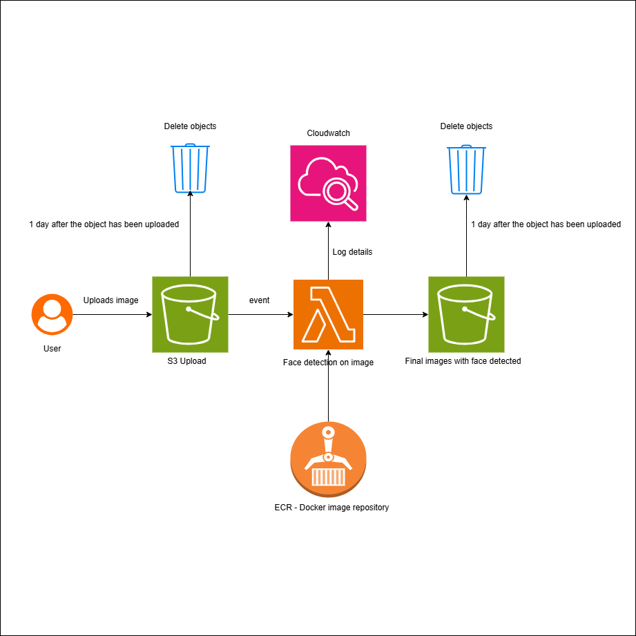
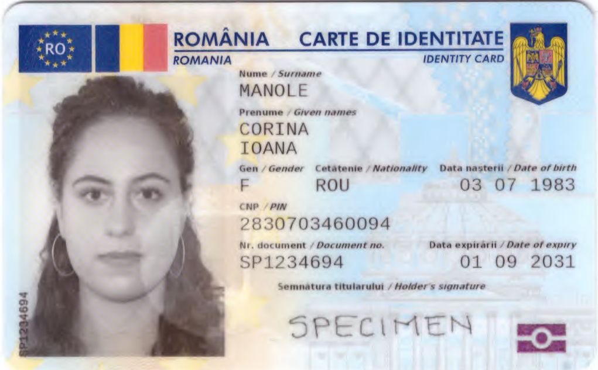
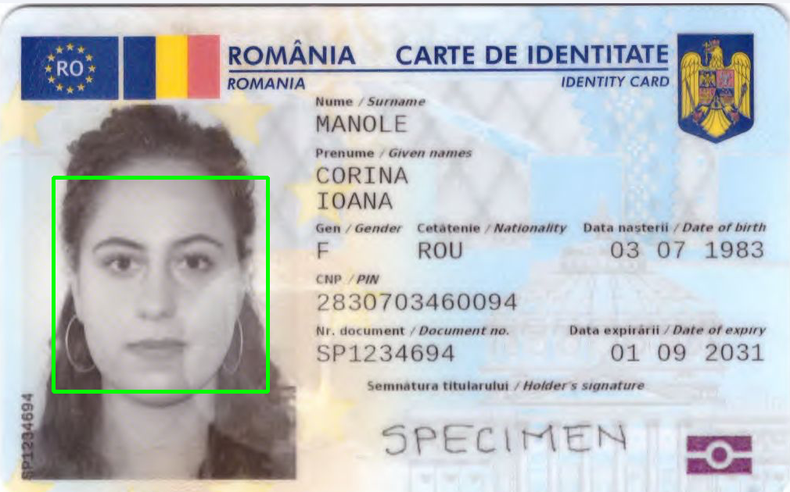

# AWS_Image_Processing
An application that is designed to detect faces in images using AWS Lambda, S3, Cloudwatch and ECR. 

The following diagram shows how services are connected to each other:

To understand how the application is working, first we need to understand how the flow works:

1. **Upload an image to S3**: The user uploads an image to the S3 bucket. This triggers a Lambda function. 
An S3 Lifecycle Rule is set to delete the image after 1 day.
2. **Trigger Lambda function**: The Lambda function is triggered by the S3 event.
The Lambda function is written in Python and uses the AWS SDK (boto3) to interact with S3, and the face detection model is done using OpenCV library.
Logs are sent to CloudWatch for monitoring and debugging purposes.
For uploading the lambda function, a Docker image is created and pushed to ECR. From there, the Lambda function is created using the ECR image.
I chose to use a Docker image for the Lambda function because it allows for more flexibility in terms of dependencies and environment setup, and also the OpenCV dependency is quite large, and it would not fit in a 50MB zip file.
3. **Save the image to S3**: The Lambda function saves the image with detected faces to a new S3 bucket.
An S3 Lifecycle Rule is set to delete the image after 1 day.

For setting up the services, I used Terraform. In terraform folder there are the configuration for creating the S3 buckets,
Lambda function, ECR repository, Cloudwatch logs and IAM roles for each service.

Example of how the application works:
1. The following mock identity card image is uploaded to the S3 upload bucket:

2. The Lambda function is triggered and the following image is saved to the S3 output bucket:
